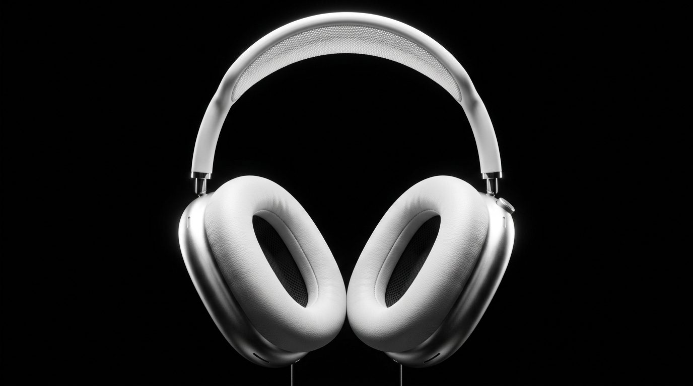

<div align="center">
  

  # Sonance Zero - Premium Audio Experience
  
  **An ultra-premium, high-performance landing page for a fictional high-end headphone brand.**

  [](https://nextjs.org/)
  [](https://reactjs.org/)
  [](https://tailwindcss.com/)
  [](https://greensock.com/gsap/)
  [](https://lenis.studiofreight.com/)

  [🚀 View Live Demo](https://sonance-phi.vercel.app)
</div>

---

## ✨ Overview

Sonance Zero is a masterclass in modern web design and front-end performance engineering. This project serves as a conceptual e-commerce landing page that prioritizes buttery-smooth scroll animations, hardware-accelerated 3D image sequences, and a luxury "glassmorphism" aesthetic.

## 🚀 Key Features

- **3D Canvas Scroll Sequence:** A 180-frame high-resolution image sequence mapped precisely to the user's scroll position, creating an interactive 3D product explosion effect.
- **Hardware-Accelerated Marquees:** Multi-directional, infinitely scrolling review cards built with GSAP and forced onto the GPU for a locked 60fps experience on mobile devices.
- **Buttery Smooth Scrolling:** Integrated `Lenis` smooth-scrolling synchronized with GSAP's requestAnimationFrame ticker to eliminate micro-stutters.
- **Glassmorphism Aesthetic:** Premium frosted glass UI overlays (`backdrop-filter`) gracefully degraded on mobile viewports to preserve battery life and rendering performance.
- **Dynamic Color Configurator:** Interactive product customization allowing users to seamlessly switch between Graphite, Midnight, and Ivory colorways with pure CSS fade transitions.

## 💻 Tech Stack

| Technology | Description |
|------------|-------------|
| **[Next.js (App Router)](https://nextjs.org/)** | React framework for SSR and optimized asset delivery |
| **[React 18](https://react.dev/)** | Core UI library utilizing hooks (`useRef`, `useEffect`, `useState`) |
| **[Tailwind CSS v4](https://tailwindcss.com/)** | Utility-first CSS framework for rapid, responsive styling |
| **[GSAP (ScrollTrigger)](https://greensock.com/gsap/)** | Industry-standard animation library for scroll-linked timelines |
| **[Lenis](https://lenis.studiofreight.com/)** | Lightweight, highly-performant smooth scroll engine |

## 🏎️ Performance Optimizations

1. **Lazy Canvas Loading:** The 3D scroll sequence only waits for the *first* frame to download before rendering the page, allowing the remaining 179 frames to download silently in the background.
2. **GPU Offloading:** Heavy animated elements utilize `transform: translateZ(0)` and `will-change: transform` to bypass the main thread.
3. **Adaptive UI:** CSS Backdrop blurs are aggressively disabled on mobile viewports to prevent GPU thermal throttling.

## 🛠️ Local Development

To run this project locally on your machine:

1. **Clone the repository:**
   ```bash
   git clone https://github.com/John26hub/headphone-website.git
   cd headphone-website
   ```

2. **Install dependencies:**
   ```bash
   npm install
   ```

3. **Start the development server:**
   ```bash
   npm run dev
   ```

4. **View the application:**
   Open [http://localhost:3000](http://localhost:3000) in your browser.

## 📄 License

This project is open-source and available under the MIT License.
